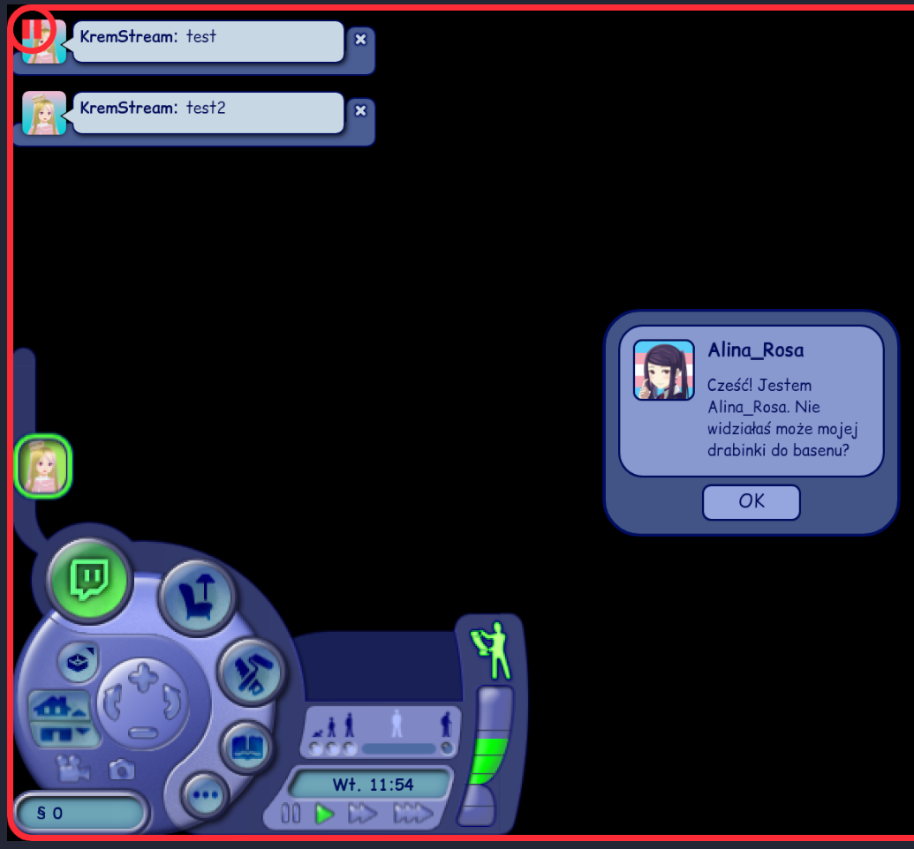
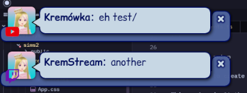
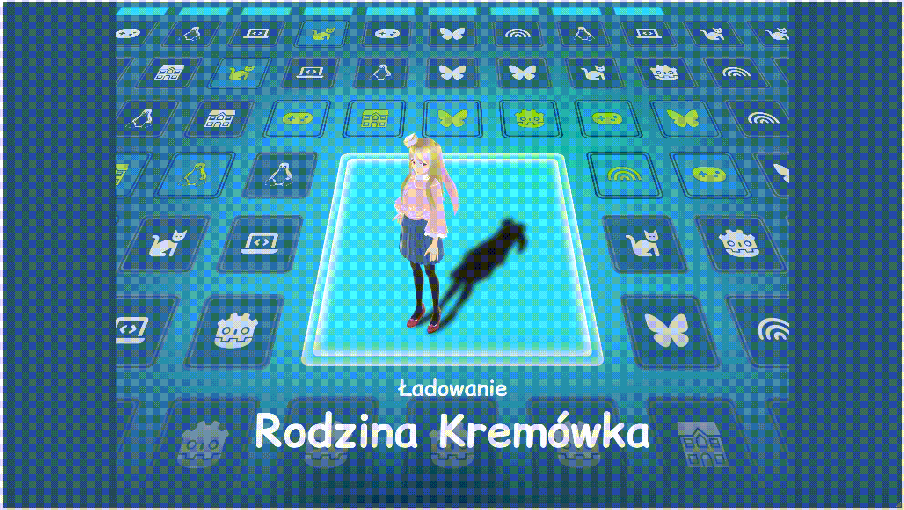

# kremstream-neo

My new twitch overlay engine. Heavy work in progress.
Based on: [krem-bun](https://github.com/Rosalina121/krem-bun)

This will work in similar way (same technologies duh), but will be more maintainable

Old project still works, it's just too janky, so decided to start from scratch

# Run

## To install

```bash
bun i
```

(You may have to also run it in /overlays/switch2 etc... dirs as well, they're separate React frontends)

To run:

```bash
bun build:overlays
bun start
```

## Required setup
### Twitch
You'll need to create an app in [Twitch Dev Console](https://dev.twitch.tv/console/apps).

This works via OAuth, so make sure to match the callback uri. Default port is 3000, so callback can be like `http://localhost:3000/auth/callback`.

### YouTube
May Sundar Pichai have mercy on your soul. 

- Go to [Google Cloud Console](https://console.cloud.google.com/)
- Create new project
- Enable YouTube Data API v3
- Create OAuth 2.0 credentials (choose Web application)
  - make sure to select the YouTube Data API v3 scopes, not sure which exactly are needed, but readonly ones should be enough
- Set redirect URI to the same one as in `.env`

This, and stuff like secrets and ids are to be stored in a `.env` file. Create one with following props:

```
TWITCH_CLIENT_ID=your_client_id
TWITCH_CLIENT_SECRET=your_client_secret
TWITCH_REDIRECT_URI=http://localhost:3000/auth/callback
TWITCH_USER_ID=your_user_id

YOUTUBE_CLIENT_ID=your_youtube_client_id
YOUTUBE_CLIENT_SECRET=your_youtube_client_secret
YOUTUBE_REDIRECT_URI=http://localhost:3000/auth/callback

OBS_WS_PASSWORD=obs_websocket_password
```
All are self explanatory. You can find your user_id via a simple API call, or just any website that offers that.

Technically chat can work well without OAuth, or any auth for that matter (see [tmi.js](https://tmijs.com/)), but here we're listening on a websocket that also provides follows and events like message_deleted, that AFAIK can only be listened on with OAuth, so that's why.

# Usage
## Server
On the server side of things there's a websocket handling all communications, currently between:
- Twitch API websocket
- YouTube events
- Admin views
- Overlays
- Easter eggs

Some flow examples:
- Twitch API -> Server -> Overlays
- Twitch API -> Server -> Easter eggs
- Admin view -> Server -> Overlays

Planned (to bring it up to speed compared to `krem-bun`):
- OBS websocket API
- VNyan websocket API

## Chat Emotes
By default all chat messages are parsed for any global Twitch, 7TV, BetterTTV and FrankerZ Emotes. You could also add in channel specific ones by adapting the fetcher calls. This includes also messages from YouTube, so YT chat can use Twitch emotes (tho it will be only seen on the overlay). No YT emotes support for now, yet.

*Note:* Sometimes animated emotes may not show instantly, or even time-out. This seems to be
a Twitch CDN issue, as it randomly loads fast or doesn't at all. On tech side this seems to only happen when using the `default` URL path rather than `animated` one, but I'm not sure how to check if an emote is animated and force it. May be done on the library level perhaps, but as per docs, default **should** work fine (even though it doesn't). your mileage may vary.

## Overlays
Overlays are generally a separate, self-contained React apps,
that communicate with the server via a websocket.
Most just receive follows, chats and chat deletes, plus some overlay-specific messages (like a dark mode toggle).

Following is/will be a breakdown of overlay-specific things, and stuff that stands out from the general functionality.

### Switch 2
Overlay checks if the incoming messages contain `!L` or `!R` (case-insensitive) and move the cursor between "buttons" on the UI,
just like in the Switch 2 OS UI. Buttons are defined in a simple array, including the icon (which is just from the `react-icons`), so super easy to change.

The camera cutout has a dirty hacky CSS so that the transparency can be a rounded rectangle, yet still have this nice gradient moving border. It's ugly, it's rough, and frankly I'm surprised that OBS browser source handles it well.

### Sims 2
This is a direct port of the Sims 2 overlay from the `krem-bun`.
Essentially recreates The Sims 2 UI, where new messages are notifications, and follows dialog popups. Has a functional clock (weekdays are in Polish, but you can easily swap them). Also shows the source of the message (currently only YouTube and Twitch)

I've rewritten the animation handling, and now it's making use of the follow queue. The cash label is unused, not sure what to put there. Used to show now playing song, but I'm not planning on
including that here for now.

This also has a pause screen that looks exactly like the game one. Additionally, there's also a logic that will pause the
stream scene as well in OBS. This requires:
- [OBS Freeze filter](https://github.com/exeldro/obs-freeze-filter)
- Your scene to have a top-level group named `<SceneName> Grouped`, so if my scene is named "OV Sims2" it contains "OV Sims2 Grouped".
This grouped scene then has the Freeze filter on it and includes all the sources.

If this doesn't work for your setup, you can adapt what the request send to the OBS websocket,
or just comment it out. Websocket handler has, well, no error handling so if something goes wrong
the whole app crashes lol.




## Waits

Additionally to stream overlays we've also got some wait screens matching above overlays.

### Sims 2 Wait

Based on the loading screen from Sims 2. Surprisingly... it's all React and janky-ass CSS. Modifying may prove to be a challenge, but you can easily swap icons (kept as `react-icons`), text and the portrait. It's also, just like others, hardcoded for 1080p. In this case adapting for other resolutions would require tinkering with the 3D transform and grid layout. Just FYI.




## External programs
### OBS
There's a websocket server connected to the OBS' one. You can change scenes and do other stuff straight from the deck view.

## Extras
### OCR
There's a simple draft OCR implementation with `tesseract.js`. It grabs a frame from an OBS source (or scene) and just rawdoggs it and spits out garbage.
I had hoped to use it to get live stats from Mario Kart for an overlay, but now I think that should be an external project. Leaving the draft in code, who knows, maybe it will come in handy.

## TODOs and WIPs
- [ ] Error handling for OBS requests
  - [ ] checks if scenes are valid
  - [ ] don't crash everything on tiny errors
